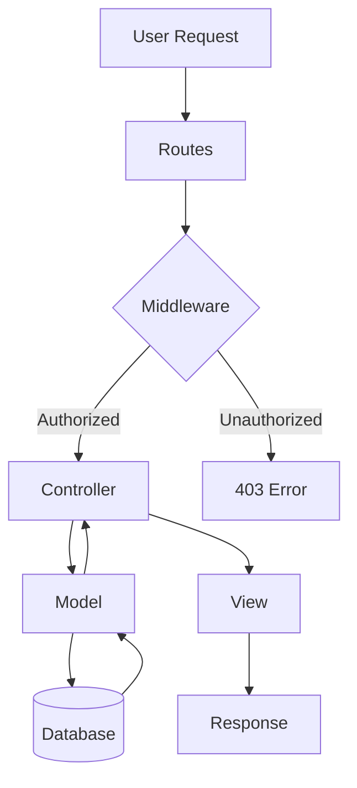
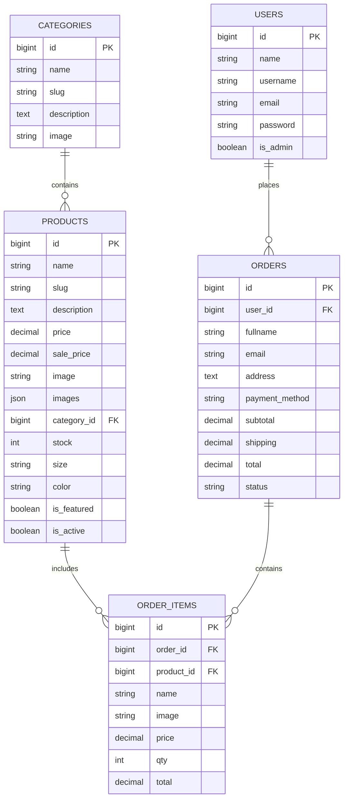
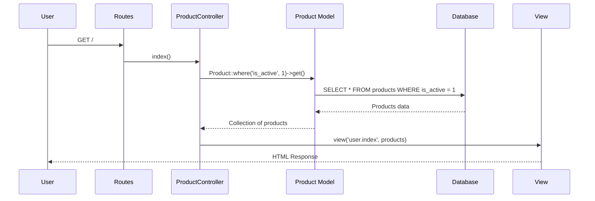
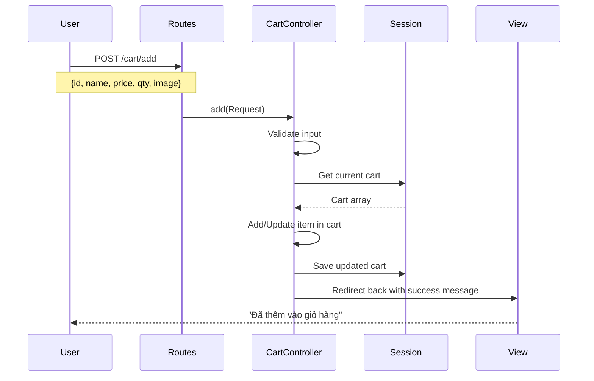
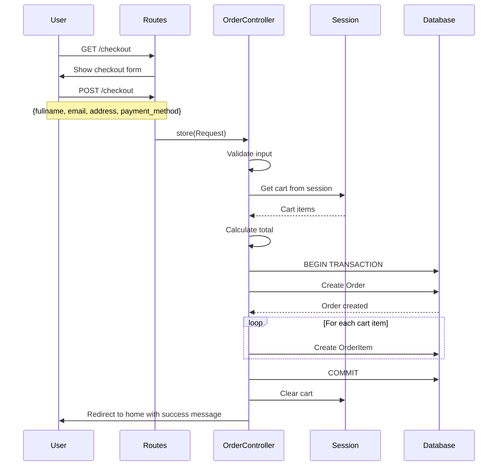
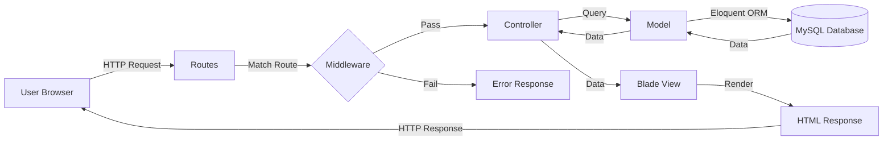

# QUY TRÌNH HOẠT ĐỘNG PROJECT

## 🎯 TỔNG QUAN DỰ ÁN

**Tên dự án:** Hệ thống Quản lý Bán hàng Laravel  
**Loại hình:** E-commerce Website (Bán hàng trực tuyến)  
**Framework:** Laravel (PHP)  
**Database:** MySQL/SQLite  
**Mô hình:** MVC (Model-View-Controller)

---

## 🏗️ KIẾN TRÚC HỆ THỐNG

### 1. Cấu trúc thư mục chính

```
webnc/
├── app/
│   ├── Http/
│   │   ├── Controllers/          # Controllers xử lý logic
│   │   │   ├── Admin/           # Controllers cho Admin
│   │   │   │   ├── ProductController.php
│   │   │   │   ├── CategoryController.php
│   │   │   │   ├── OrderController.php
│   │   │   │   └── UserController.php
│   │   │   ├── Auth/            # Controllers xác thực
│   │   │   ├── ProductController.php
│   │   │   ├── CartController.php
│   │   │   └── OrderController.php
│   │   └── Middleware/
│   │       └── IsAdmin.php      # Middleware phân quyền admin
│   └── Models/                  # Models (Eloquent ORM)
│       ├── Product.php
│       ├── Category.php
│       ├── Order.php
│       ├── OrderItem.php
│       └── User.php
├── database/
│   ├── migrations/              # Database schema
│   └── seeders/                 # Dữ liệu mẫu
├── resources/
│   └── views/                   # Giao diện (Blade Templates)
│       ├── admin/               # Giao diện admin
│       └── user/                # Giao diện người dùng
├── routes/
│   └── web.php                  # Định tuyến
└── public/                      # Assets (CSS, JS, Images)
```

### 2. Mô hình MVC



---

## 📦 CÁC THÀNH PHẦN CHÍNH

### 1. Models (Mô hình dữ liệu)

#### **Product (Sản phẩm)**
```php
Thuộc tính:
- id, name, slug, description
- price, sale_price
- image, images (array)
- category_id (FK)
- stock, size, color
- is_featured, is_active

Relationships:
- belongsTo(Category)
- hasMany(OrderItem)

Computed Properties:
- display_price: Giá hiển thị (ưu tiên sale_price)
- is_on_sale: Kiểm tra có đang giảm giá không
```

#### **Category (Danh mục)**
```php
Thuộc tính:
- id, name, slug, description, image

Relationships:
- hasMany(Product)
```

#### **Order (Đơn hàng)**
```php
Thuộc tính:
- id, user_id (FK)
- fullname, email, address
- payment_method
- subtotal, shipping, total
- status (processing, paid, shipped, delivered, cancelled)

Relationships:
- belongsTo(User)
- hasMany(OrderItem)
```

#### **OrderItem (Chi tiết đơn hàng)**
```php
Thuộc tính:
- id, order_id (FK), product_id (FK)
- name, image, price, qty, total

Relationships:
- belongsTo(Order)
- belongsTo(Product)
```

#### **User (Người dùng)**
```php
Thuộc tính:
- id, name, username, email, password
- is_admin (boolean)

Relationships:
- hasMany(Order)
```

### 2. Database Schema



---

## 🔄 QUY TRÌNH HOẠT ĐỘNG CHI TIẾT

### A. PHẦN NGƯỜI DÙNG (User-Facing)

#### 1. Xem danh sách sản phẩm



**Quy trình:**
1. User truy cập trang chủ `/` hoặc `/index`
2. Route điều hướng đến `ProductController@index`
3. Controller query database lấy sản phẩm active
4. Trả về view `user.index` với danh sách sản phẩm
5. View hiển thị danh sách sản phẩm cho user

#### 2. Xem chi tiết sản phẩm

```
User → GET /product/{id}
     → ProductController@show
     → Tìm sản phẩm theo ID/slug/SKU
     → Nếu tìm thấy: Hiển thị view product detail
     → Nếu không: 404 Error
```

#### 3. Thêm vào giỏ hàng



**Quy trình:**
1. User nhấn "Thêm vào giỏ"
2. POST request đến `/cart/add` với dữ liệu sản phẩm
3. `CartController@add` validate dữ liệu
4. Lấy giỏ hàng từ session
5. Nếu sản phẩm đã có: Tăng số lượng
6. Nếu chưa có: Thêm mới vào giỏ
7. Lưu giỏ hàng vào session
8. Redirect về trang trước với thông báo

**Cấu trúc Cart trong Session:**
```php
[
    'product-1' => [
        'id' => 'product-1',
        'name' => 'Áo thun nam',
        'price' => 199000,
        'qty' => 2,
        'image' => 'path/to/image.jpg'
    ],
    'product-2' => [...]
]
```

#### 4. Quản lý giỏ hàng

**Xem giỏ hàng:**
```
GET /cart → CartController@index → view('user.viewcart')
```

**Cập nhật số lượng:**
```
POST /cart/update {id, qty}
→ CartController@update
→ Update qty in session
→ Redirect back
```

**Xóa sản phẩm:**
```
POST /cart/remove {id}
→ CartController@remove
→ unset($cart[$id])
→ Redirect back
```

**Xóa toàn bộ giỏ:**
```
POST /cart/clear
→ CartController@clear
→ session()->forget('cart')
→ Redirect back
```

#### 5. Đặt hàng (Checkout)



**Quy trình chi tiết:**
1. User điền form checkout (fullname, email, address, payment_method)
2. POST đến `/checkout`
3. `OrderController@store` validate dữ liệu
4. Lấy giỏ hàng từ session
5. Kiểm tra giỏ hàng không rỗng
6. Tính tổng tiền (subtotal)
7. **Bắt đầu transaction:**
   - Tạo Order mới với status = 'processing'
   - Tạo OrderItem cho từng sản phẩm trong giỏ
8. **Commit transaction**
9. Xóa giỏ hàng khỏi session
10. Redirect về trang chủ với thông báo thành công

#### 6. Xem đơn hàng

```
GET /account/orders/{order}
→ Middleware: auth (phải đăng nhập)
→ OrderController@show
→ Kiểm tra order thuộc về user hiện tại
→ Load order với items
→ view('user.order')
```

#### 7. Thanh toán đơn hàng (Demo)

```
POST /account/orders/{order}/pay
→ OrderController@pay
→ Update status = 'paid'
→ Redirect back với thông báo
```

---

### B. PHẦN QUẢN TRỊ (Admin)

#### 1. Middleware bảo mật

```php
// File: app/Http/Middleware/IsAdmin.php
public function handle(Request $request, Closure $next)
{
    $user = Auth::user();
    
    // Kiểm tra đăng nhập và quyền admin
    if (!$user || !$user->is_admin) {
        abort(403, 'Unauthorized.');
    }
    
    return $next($request);
}
```

**Áp dụng:**
```php
Route::prefix('admin')
    ->middleware(['auth', 'is_admin'])  // Phải đăng nhập + là admin
    ->group(function () {
        // Tất cả routes admin
    });
```

#### 2. CRUD Sản phẩm (Admin)

```mermaid
graph TB
    A[Admin Dashboard] --> B{Chọn chức năng}
    B -->|Xem danh sách| C[GET /admin/products]
    B -->|Thêm mới| D[GET /admin/products/create]
    B -->|Sửa| E[GET /admin/products/{id}/edit]
    B -->|Xóa| F[DELETE /admin/products/{id}]
    
    C --> G[ProductController@index]
    G --> H[Hiển thị danh sách + phân trang]
    
    D --> I[ProductController@create]
    I --> J[Hiển thị form + danh sách categories]
    J --> K[User submit form]
    K --> L[POST /admin/products]
    L --> M[ProductController@store]
    M --> N{Validate}
    N -->|Valid| O[Upload image nếu có]
    O --> P[Tạo slug tự động]
    P --> Q[Product::create]
    Q --> R[Redirect về index với thông báo]
    N -->|Invalid| S[Quay lại form với lỗi]
    
    E --> T[ProductController@edit]
    T --> U[Load product + categories]
    U --> V[Hiển thị form với dữ liệu cũ]
    V --> W[User submit]
    W --> X[PUT /admin/products/{id}]
    X --> Y[ProductController@update]
    Y --> Z{Validate}
    Z -->|Valid| AA[Upload image mới nếu có]
    AA --> AB[Update product]
    AB --> AC[Redirect về index]
    Z -->|Invalid| AD[Quay lại form với lỗi]
    
    F --> AE[ProductController@destroy]
    AE --> AF[Xóa product]
    AF --> AG[Redirect về index]
```

**Chi tiết các action:**

**INDEX - Danh sách:**
```php
GET /admin/products
→ ProductController@index
→ Product::with('category')->latest()->paginate(15)
→ view('admin.products.index', compact('products'))
```

**CREATE - Form thêm mới:**
```php
GET /admin/products/create
→ ProductController@create
→ Category::all()
→ view('admin.products.create', compact('categories'))
```

**STORE - Lưu sản phẩm mới:**
```php
POST /admin/products
→ ProductController@store
→ Validate: name, price, category_id, stock, image...
→ Upload image: $request->file('image')->store('products', 'public')
→ Auto slug: Str::slug($name)
→ Product::create($validated)
→ redirect()->route('admin.products.index')->with('success', ...)
```

**EDIT - Form sửa:**
```php
GET /admin/products/{product}/edit
→ ProductController@edit(Product $product)  // Route Model Binding
→ Category::all()
→ view('admin.products.edit', compact('product', 'categories'))
```

**UPDATE - Cập nhật:**
```php
PUT /admin/products/{product}
→ ProductController@update(Request, Product $product)
→ Validate
→ Upload image mới (nếu có)
→ $product->update($validated)
→ redirect()->route('admin.products.index')->with('success', ...)
```

**DESTROY - Xóa:**
```php
DELETE /admin/products/{product}
→ ProductController@destroy(Product $product)
→ $product->delete()
→ redirect()->route('admin.products.index')->with('success', ...)
```

#### 3. CRUD Categories, Users

**Tương tự như Products:**
- `CategoryController`: Quản lý danh mục
- `UserController`: Quản lý người dùng
- Cùng pattern: index, create, store, edit, update, destroy

#### 4. Quản lý đơn hàng (Admin)

```
GET /admin/orders
→ OrderController@index
→ Hiển thị danh sách đơn hàng

GET /admin/orders/{order}
→ OrderController@show
→ Hiển thị chi tiết đơn hàng + items

POST /admin/orders/{order}/status
→ OrderController@updateStatus
→ Cập nhật trạng thái đơn hàng

POST /admin/orders/{order}/approve
→ OrderController@approve
→ Phê duyệt đơn hàng

POST /admin/orders/{order}/reject
→ OrderController@reject
→ Từ chối đơn hàng
```

---

## 🔐 BẢO MẬT VÀ PHÂN QUYỀN

### 1. Authentication (Xác thực)

```php
// Routes yêu cầu đăng nhập
Route::middleware('auth')->group(function () {
    Route::get('/account', ...);
    Route::get('/account/orders/{order}', ...);
});
```

### 2. Authorization (Phân quyền)

```php
// Routes chỉ dành cho admin
Route::middleware(['auth', 'is_admin'])->group(function () {
    // Tất cả routes admin
});
```

### 3. CSRF Protection

```blade
<!-- Tất cả form đều có CSRF token -->
<form method="POST">
    @csrf
    ...
</form>
```

### 4. Validation

```php
// Validate dữ liệu đầu vào
$validated = $request->validate([
    'name' => 'required|string|max:255',
    'price' => 'required|numeric|min:0',
    'email' => 'required|email',
]);
```

---

## 📊 LUỒNG DỮ LIỆU TỔNG QUAN



---

## 🎯 CÁC CHỨC NĂNG CHÍNH

### Người dùng (User):
1. ✅ Xem danh sách sản phẩm
2. ✅ Xem chi tiết sản phẩm
3. ✅ Thêm vào giỏ hàng
4. ✅ Quản lý giỏ hàng (xem, sửa, xóa)
5. ✅ Đặt hàng (checkout)
6. ✅ Xem lịch sử đơn hàng
7. ✅ Thanh toán đơn hàng (demo)
8. ✅ Đăng ký / Đăng nhập
9. ✅ Tìm kiếm sản phẩm

### Quản trị viên (Admin):
1. ✅ CRUD Sản phẩm (Create, Read, Update, Delete)
2. ✅ CRUD Danh mục
3. ✅ CRUD Người dùng
4. ✅ Quản lý đơn hàng (xem, cập nhật trạng thái)
5. ✅ Dashboard thống kê
6. ✅ Upload hình ảnh sản phẩm
7. ✅ Phân trang dữ liệu

---

## 🔧 CÔNG NGHỆ SỬ DỤNG

| Thành phần | Công nghệ |
|------------|-----------|
| Backend Framework | Laravel (PHP) |
| Database | MySQL / SQLite |
| ORM | Eloquent |
| Template Engine | Blade |
| Frontend | HTML, CSS, JavaScript |
| CSS Framework | Tailwind CSS / Bootstrap |
| Authentication | Laravel Auth |
| Session Management | Laravel Session |
| File Storage | Laravel Storage (public disk) |

---

## 📈 QUY TRÌNH XỬ LÝ MẪU

### Ví dụ: User đặt hàng một sản phẩm

```
1. User vào trang chủ
   GET / → ProductController@index → Hiển thị danh sách sản phẩm

2. User click vào sản phẩm
   GET /product/5 → ProductController@show → Hiển thị chi tiết

3. User nhấn "Thêm vào giỏ"
   POST /cart/add {id: 5, name: "Áo thun", price: 199000, qty: 1}
   → CartController@add
   → Lưu vào session['cart']
   → Redirect back với thông báo

4. User vào giỏ hàng
   GET /cart → CartController@index → Hiển thị giỏ hàng

5. User nhấn "Thanh toán"
   GET /checkout → Hiển thị form checkout

6. User điền thông tin và submit
   POST /checkout {fullname, email, address, payment_method}
   → OrderController@store
   → Validate dữ liệu
   → Tạo Order và OrderItems trong database
   → Xóa giỏ hàng
   → Redirect về trang chủ với thông báo thành công

7. Admin xem đơn hàng mới
   GET /admin/orders → OrderController@index → Danh sách đơn hàng
   GET /admin/orders/1 → OrderController@show → Chi tiết đơn

8. Admin cập nhật trạng thái
   POST /admin/orders/1/status {status: 'shipped'}
   → OrderController@updateStatus
   → Update order.status = 'shipped'
   → Redirect back
```

---

## 💡 ĐIỂM MẠNH CỦA HỆ THỐNG

1. **Kiến trúc MVC rõ ràng:** Tách biệt logic, dữ liệu, giao diện
2. **Eloquent ORM:** Thao tác database dễ dàng, an toàn
3. **Route Model Binding:** Tự động load model từ URL
4. **Middleware bảo mật:** Phân quyền rõ ràng
5. **Session-based Cart:** Đơn giản, không cần database
6. **Transaction:** Đảm bảo tính toàn vẹn dữ liệu khi đặt hàng
7. **Validation:** Kiểm tra dữ liệu đầu vào chặt chẽ
8. **Flash Messages:** Thông báo người dùng trực quan

---

## 🚀 HƯỚNG PHÁT TRIỂN

1. **Tích hợp thanh toán online:** VNPay, MoMo, Stripe
2. **Báo cáo thống kê:** Doanh thu, sản phẩm bán chạy
3. **Quản lý kho:** Tự động trừ stock khi đặt hàng
4. **Email notification:** Gửi email xác nhận đơn hàng
5. **Review & Rating:** Đánh giá sản phẩm
6. **Wishlist:** Danh sách yêu thích
7. **Coupon/Discount:** Mã giảm giá
8. **Multi-language:** Đa ngôn ngữ
9. **API:** RESTful API cho mobile app
10. **Real-time notification:** WebSocket cho admin

---

## 📝 KẾT LUẬN

Hệ thống quản lý bán hàng Laravel này được xây dựng theo mô hình MVC chuẩn, với các chức năng cơ bản đầy đủ cho một website e-commerce. Quy trình hoạt động rõ ràng, dễ bảo trì và mở rộng. Phù hợp cho các dự án học tập và triển khai thực tế cho các cửa hàng vừa và nhỏ.
